# **voiture-autonome-2021**
Projet de voiture autonome - Centrale Lille - 2021

## **Répartition du travail**

 **Louis Delsol :** Code Python pour le suivi de lignes
 
 **Luiz Fabião Giserman :** communication entre serveur | voiture, serial RaspberryPi arduino, sockets AF_UNIX entre C et Python et envoye des coordonnées du MarvelMind
 
 **Simon Kurney :** impression 3D du support de caméra, automatique
 
 **Théo Lecoutre :** IA pour la reconnaissance des panneaux et détection d'objets, code Python principal du système, sockets AF_UNIX internes entre C et Python
 
 **Mário Monteiro :** automatique
 
 **Ilyas Ouardi :** communication, solution alternative pour l'IA (modèle RCNN)
 
 **Noé Pigret :** automatique
 
 **Sun Yishan :** communication, reception des coordonées du systéme Marvelmind
 

## **Reconnaissance d'objets**

La reconnaissance d'objets est une partie cruciale de notre projet, car l'autonomie de notre voiture passe impérativement par la perception de son environnement.

### **Matériel**

Le matériel utilisé pour la perception de l'environnement se compose de :
* **un Raspberry Pi 3 Model B+**
* **une caméra 5 MPx pour Raspberry Pi (vient de element14.com) :** ce sera les "yeux" de notre maquette
* **l'accélérateur USB Coral Edge TPU Coprocessor :** le Raspberry Pi 3 étant peu puissant, la reconnaissance d'objet par intelligence artificielle prend beaucoup de temps. Cet accélérateur permet de faire fonctionner le modèle d'IA plus rapidement.

### **Logiciel**
La partie logicielle se décompose en 2 parties :
* **OpenCV** est une librairie Python open source , qui permet la lecture du flux vidéo de la webcam, ainsi que son traitement
* **Tensorflow** est une plateforme complète d'intelligence artifcielle : elle permettra de créer notre modèle, de l'entraîner, et de connaître ses prédictions pour notre environnement.

### **Déroulé du travail**

Pour mener à bien cette partie de notre projet, nous avons identifié 3 étapes clés :

1. Nous devons constituer un dataset des objets que notre véhicule doit pouvoir détecter
2. Nous devons créer/trouver un modèle de réseau de neurones et l'entraîner sur notre dataset
3. Lors du fonctionnement de notre maquette, le véhicule doit pouvoir reconnaître les objets qui l'entourent.

#### **Le dataset**

Le dataset constitue la partie la plus importante de la reconnaissance d'objet : même le réseau de neurones le plus entraîné et performant demeurera médiocre avec un mauvais dataset (déséquilibré, éloigné de la réalité...).

Dans un premier temps, nous avons identifié les objets que notre maquette doit être capable de reconnaître :

* panneau **sens interdit**
* panneau **stop**
* panneau **zone 30**
* panneau de **vitesse 50**
* panneau de **passage piéton**

[comment]: <> (TODO : mettre les images des objets)

Une fois identifiés, il nous faut des images de ces objets pour consituter notre dataset. Pour cela, nous avons choisi d'imprimer les panneaux, pour ensuite les prendre en photo sous différents profils (environ 50 photos de chaque panneau). De même le piéton sera modélisé par un stylo.

Une fois que nous avons ces images, nous devons les traiter à la main, afin d'indiquer à notre modèle quels sont et où sont les objets à détecter sur ces images.

Nous avons utilisé le logiciel labelImg qui permet de réaliser cela : à partir des bounding boxes que nous plaçons sur une image, LabelImg génère un fichier XML par image, au format Pascal VOC, indiquant les coordonnées de chaque bounding box, et l'objet identifié.

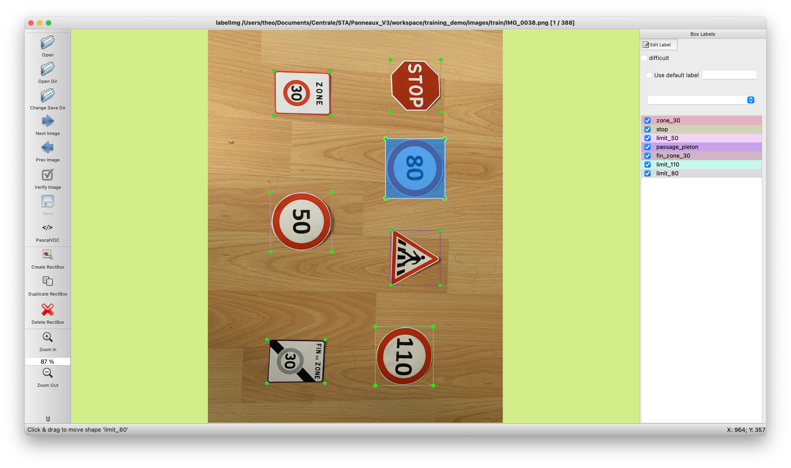
**Le logiciel labelImg en action**

#### **Le réseau de neurones**

Pour des raisons de complexité et de temps évidentes, nous n'avons pas créé notre propre réseau de neurones.

Nous avons eu recours au "transfer learning" : il s'agit d'utiliser un modèle déjà existant en entraîné sur un dataset, pour le ré-entraîner sur notre propre dataset.
Il existe deux solutions de transfer learning : 

* **ré-entraîner uniquement les dernières couches du modèle :** il s'agit d'uniquement ré-entraîner les dernières couches du modèle (celles qui donnent finalement la classification) sur notre dataset. Le résultat sera moins précis qu'un ré-entraînement total, mais permet un gain de temps non négligeable
* **ré-entraîner le modèle entier :** cela permet généralement une meilleure précision, mais nécessite beaucoup de temps et de ressources. De plus, il faut généralement un grand dataset (beaucoup plus de 50 images par objet, ce qui est déjà peu...) pour éviter l'overfitting.

Nous nous sommes donc naturellement tournés vers la première solution.

Nous avons choisi le réseau de neurones SSD MobileNet V1, qui est compatible avec le TPU Coral et qui présente un rapport précision/rapidité intéressant. Ce modèle est par défaut entraîné avec le dataset COCO, constitué de 90 objets de la vie courante.

Après avoir configuré la pipeline d'entraînement (configuration de l'entraînement : chemin d'accès aux images, graphes...) et gelé certaines couches du modèles (pour ré-entraîner uniquement les dernières), nous avons entraîné notre modèle avec 500 étapes.

Après cet entraînement, nous exportons le graphe de notre réseau au format TensorFlow Lite : c'est un format qui permet de stocker les variables sur des entiers (au lieu de flottants), permettant ainsi une exécution plus rapide, et une compatibilité avec le TPU Coral.

Une fois l'exportation réalisé", nouscompilons le model (au format .tflite) que nous obtenons grâce à l'outil edgetpu_compiler fourni sur le site de Coral, qui permet d'optimiser le modèle pour qu'il s'exécute de manière plus rapide sur le TPU.

Les résultats que nous obtenons à priori sont satisfaisants : 

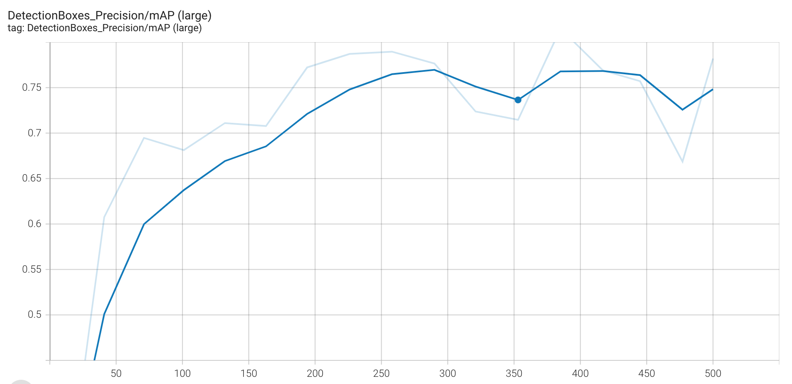
**La courbe de précision en fonction des entraînements**

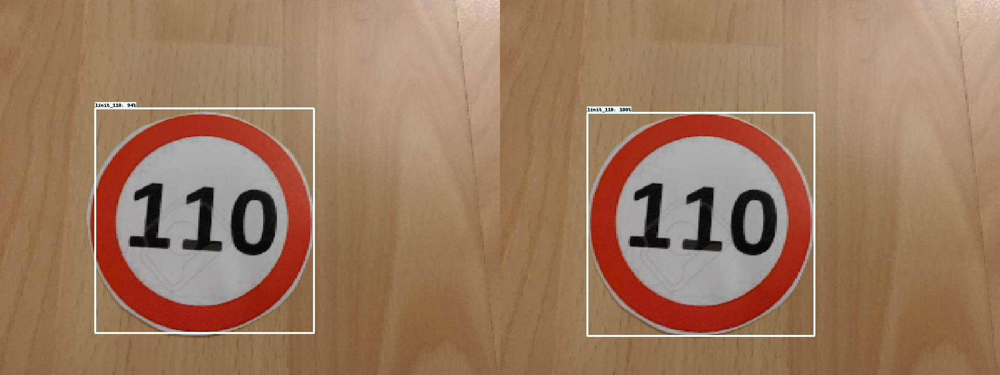
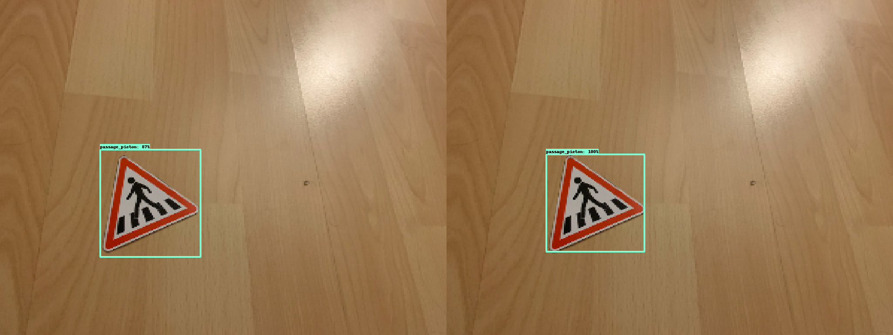
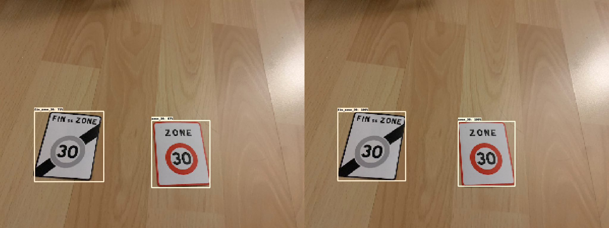
**Quelques comparaisons reconnaissance effective (à gauche)/reconnaissance théorique parfaite (à droite)**

#### **Interfaçage avec le reste du code**

Pour chaque image que le réseau de neurones traite, ils produit 3 variables de sortie qui nous intéressent :

1. Les **boundings boxes**, qui contiennent les coordonnées de chaque rectangle de détection potentielle
2. Les **classes**, un tableau contenant le numéro de classe pour chaque potentielle détection
3. Les **scores**, un tableau contenant le score de chaque potentielle détection (le score est compris entre 0 et 1). Nous considérons les prédictions comme fiables quand elles ont un score supérieur ou égal à 0,7.

Ainsi à partir de ces 3 variables, la maquette pourra connaître, à chaque image transmise par la webcam, la composition de son environnement.

## **Communication**

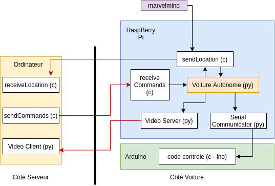

Dans cette image, les fleches rouges sont des connections TCP AF_INET. Les noirs entre dispositifs sont des connections seriales et les autres sont des communications sockets AF_UNIX.

### **Côte Serveur**

* **Dossier communication/serveur**:
  * **receiveLocation.c** : Écoutes les données de cordonnées de la voiture par sockets (client TCP). Interface CLI.
  * **sendCommands.c** : Envoie à la voiture des commands comme nouvelle cordonné de destination ou d'arreter, par example (serveur TCP). Interface CLI.
* **video_client.py** : Video client TCP pour recevoir le stream de video live.

### **Côte Voiture**

* **Dossier communication/raspberry**:
  * **receiveCommands.c** : Écoutes les commands du serveur par sockets (client TCP).
  * **sendLocation.c** : Fait la lecture serial des données du Hedgehog Marvelmind, les envoie par sockets AF_INET au serveur et au **serial_communicator.py** par sockets AF_UNIX

**server_communication.py** : Une class python qui est le serveur AF_UNIX autant que interface pour recuperer les données du programme C dans le programme princpal.

**serial_communicator.py** : Une class interface entre le raspberryPi et l'Arduino. Par le dispositif "/dev/ttyS0" (arduino) on envoie et reçoit des messages. Pour la partie d'Arduino, on a besoin de fixer une charactere qui indique le debut de la message qu'on souhaite envoyer. Cela se passe parce que si on simplement ecoute la porte dans le côté Arduino, il y a beaucoup d'autres communications aleatoires que se passent par la.
On envoie des consignes de vitesse et d'angle pour le systéme de controle d'Arduino.

## **Commande du Robot Mobile**

**I/ Présentation de la maquette**

Robot mobile de type unicycle adapté. La maquette comporte deux roues motrices indépendantes entraînant deux chenilles et se déplace sur un plan en deux dimensions. Elle est équipée de deux moteurs Makeblock avec encodeurs.

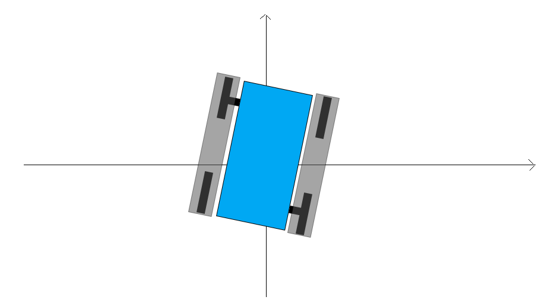

**Paramètres géométriques :**

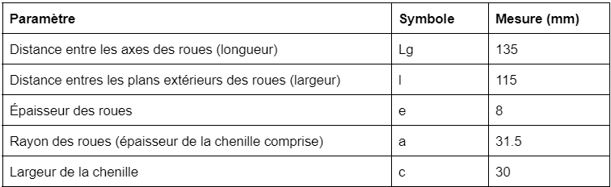

**Paramètres des moteurs :**

**II/ Présentation du problème**

L’objectif est de faire se déplacer la maquette en autonomie sur un circuit composé de routes, de signalisation et d’obstacles que le véhicule devra savoir lire. À partir de la connaissance de sa position dans le plan et de l’image de l’environnement devant elle, la voiture devra se débrouiller pour rejoindre le point (les coordonnées) qu’on lui aura communiqué, en suivant les contraintes imposées par l’environnement et la réglementation du circuit.

**Hypothèses pour la modélisation :**
* Aucun glissement latéral (le robot ne peut pas glisser latéralement sur ses chenilles)
* Roulement sans glissement (les chenilles roulent sans glisser sur le sol)
* Les chenilles sont supposées telles que les transmissions de rotation sont parfaites

**III/ Modèle cinématique**

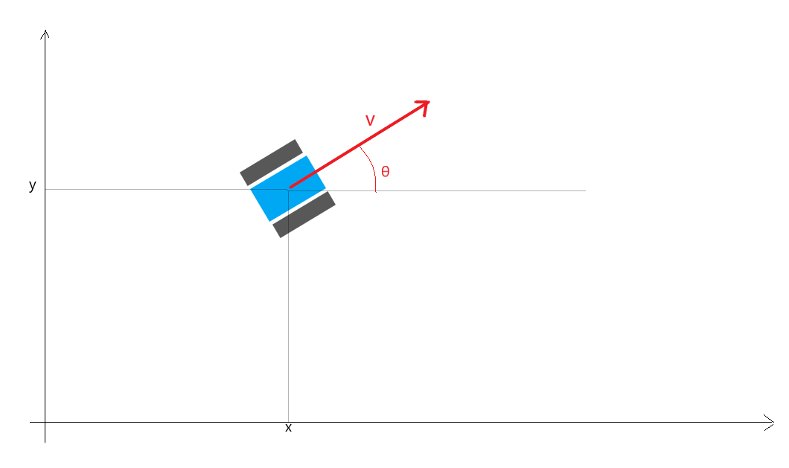

**Paramétrage du robot :**
* θ est l’orientation du robot dans le plan de référence
* (x,y) sont les coordonnées d’un point fixe sur le robot dans le plan

Pour le robot de type unicycle, on a le modèle cinématique suivant :

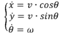

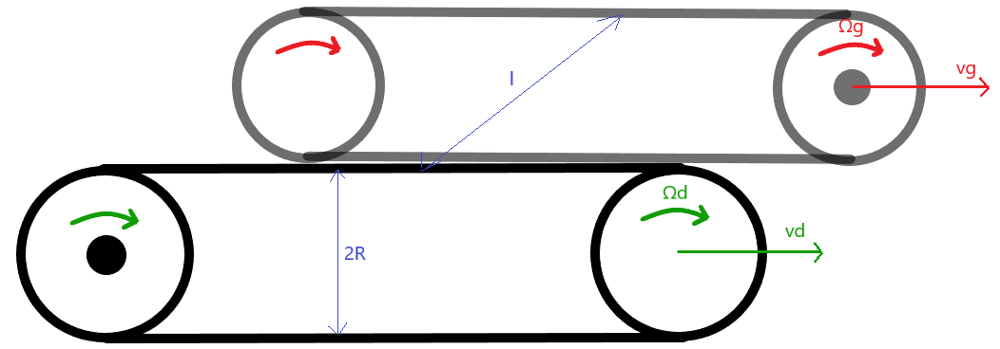

On a en particulier : 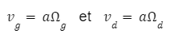

On peut alors écrire :

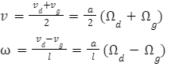

**IV/ Modèle dynamique du robot**

On peut écrire les équations du moteur électrique :

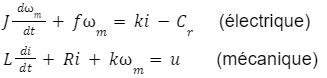

où : J est le moment d’inertie, Cr le couple résistant, f le coefficient de frottement fluide, i le courant traversant le moteur, m la vitesse de rotation du rotor, u la tension en entrée et (L,R,k) différents paramètres du moteur.

On cherche alors à écrire le modèle dynamique du moteur sous la forme : X’=AX+BU ; y=CX+DU.

On pose y = m  ,  X = (m ; i)  et  U = (Cr  ; u). On trouve dans ce cas :

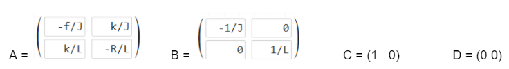

**V/ Loi de commande et simulation (sur Matlab)**

La commande du robot s'appuie essentiellement sur deux fonctions élémentaires exploitant les consignes reçues depuis le RaspberryPi : la vitesse et un angle.

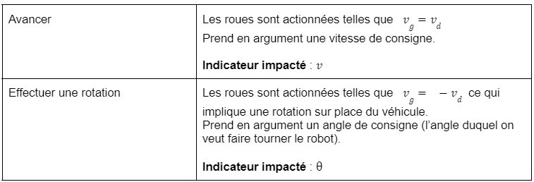

Remarques : 
* Prendre un virage s’obtient en additionnant les effets de ces deux fonctions. Pour un virage à gauche par exemple, on peut écrire : Vg=Vav-Vrot et  Vd=Vav+Vrot où Vav est la vitesse imposée par la fonction Avancer et Vrot>0 la composante d’entrée en rotation imposée par la fonction Rotation.
* Un demi-tour est équivalent ici à une rotation sur place de 180° i.e Demi-tour ~ Rotation(180).

## **Suivi de lignes**

Le suivi de lignes va consister en l'identification des bords de la routes, qui sont représenté par des lignes bleu, puis au calcul de la diréction à prendre.

Pour ce faire nous utilisons les bibliothèque de Python suivantes :
* **OpenCV** est une librairie Python open source , qui permet la lecture du flux vidéo de la webcam, ainsi que son traitement
* **Numpy** qui permet de manipuler les tableaux
* **Mathplotlib.pyplot** qui permet d'afficher les images
* **Logging**  qui permet de tenir un journal
* **Math** qui permet de faire des opérations mathématiques

### **Principe du code**

Dans un premier temps, le but est d'identifier les bordures de la route. Pour cela nous allons procéder en plusieurs étapes :
* On transforme le format BRG en HSV pour éviter les différentes teintes de bleu due à la luminosité
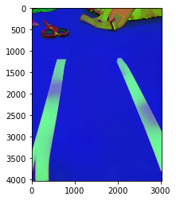
* On ne garde que les couleurs entre le bleu clair et le bleu foncé (à noter que open CV utilise une gamme de couleur entre 0 et 180)

